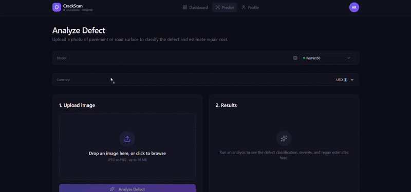
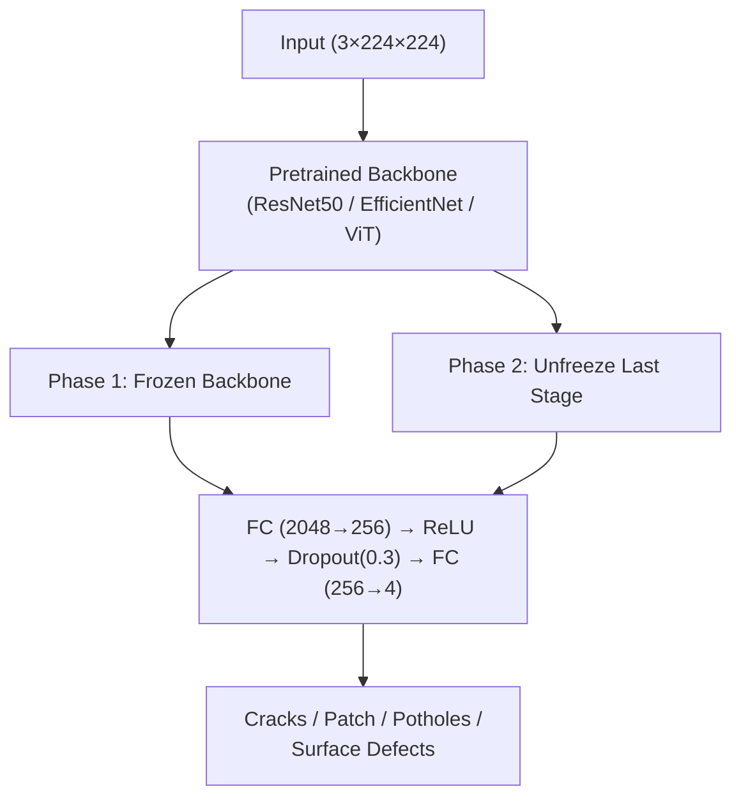
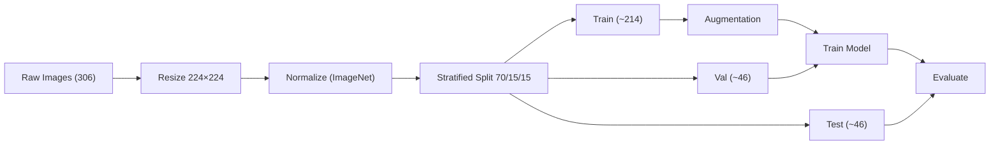

# 🛣️ Surface Crack Detection

AI-powered detection of road & bridge surface defects using deep learning.



---
## What it does

A multi-class image classifier that detects **4 types of surface defects** — cracks, patches, potholes, and general surface defects — using transfer learning (ResNet50, EfficientNet-B0, ViT-B/16) with optional ensemble inference.

| Defect Class        | Samples | % of Dataset |
| :------------------- | ------: | :-----------: |
| Cracks               |      73 |     23.9%     |
| Patch                |      42 |     13.7%     |
| Potholes              |      91 |     29.7%     |
| Surface Defects       |     100 |     32.7%     |
| **Total**             | **306** |   **100%**    |

Best model (ViT-B/16) reaches **89.1% accuracy** / **89.0% weighted F1** on the held-out test set, with potholes detected at 100% recall.

---

## Architecture





**Training:** Phase 1 warms up with a frozen backbone (5 epochs, LR 1e-3), Phase 2 fine-tunes the last stage (15 epochs, LR 1e-5), both with AdamW. Uses weighted cross-entropy with label smoothing, mixup, ReduceLROnPlateau, and early stopping.

---

## Results

| Model | Accuracy | Weighted F1 |
|:------|:--------:|:-----------:|
| ResNet50 (baseline) | 79.6% | 79.6% |
| EfficientNet-B0 | 67.4%* | — |
| **ViT-B/16** ⭐ | **89.1%** | **89.0%** |

\*best validation accuracy. Full reports and confusion matrices: [HF model reports](https://huggingface.co/amruthjakku/surface-crack-detection-model/tree/main/reports). Training tracked on [Weights & Biases](https://wandb.ai/amruthjakku/surface-crack-detection).

---

## Project structure

```
bootcamp/
├── backend/          # FastAPI app: auth, prediction, Supabase client
├── src/               # Training pipeline (config, dataset, model, train, evaluate)
├── frontend/          # Web UI
├── data/              # Processed dataset
├── notebooks/         # EDA & training notebooks
├── models/            # Trained checkpoints
├── migrations/        # Database schemas
├── Dockerfile
└── requirements.txt
```

---

## Quick start

### Docker

```bash
docker build -t surface-crack-detection .
docker run -p 7860:7860 \
  -e SUPABASE_URL=your_url \
  -e SUPABASE_SERVICE_KEY=your_key \
  -e JWT_SECRET=your_secret \
  surface-crack-detection
```

### Local development

Requires Python 3.12+ and Node.js 22+.

```bash
# one-command launcher (creates venv, installs deps, starts both services)
bash run.sh          # Linux / macOS
.\run.ps1             # Windows PowerShell
```

Or manually:

```bash
# backend
python -m venv venv
source venv/bin/activate
pip install -r requirements.txt
uvicorn backend.main:app --host 0.0.0.0 --port 8501

# frontend (separate terminal)
cd frontend
npm install
npm run dev
```

Frontend: `http://localhost:5173` · API docs: `http://localhost:8501/docs`

### Tests

```bash
pytest tests/ -v
cd frontend && npx vitest run
```

### Train

```bash
python src/prepare_data.py
python src/train.py --model resnet50       # or efficientnet_b0 / vit_b_16
python src/evaluate.py
```

---

Built by **Team 7 — ACE Bootcamp/Arvind**
